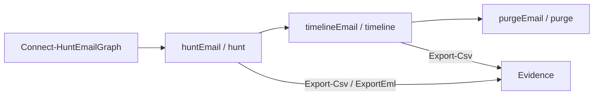

# huntEmail — Email Threat Response Toolkit

**huntEmail** is a PowerShell toolkit for Microsoft 365 email threat response. It uses Microsoft Graph (certificate auth) to search mailboxes for malicious messages, build delivery timelines, and hard-delete confirmed threats across folders — so security teams can hunt, investigate, and contain phishing in one pipeline.

---

## Features

| Capability | Script / alias | What it does |
|------------|----------------|--------------|
| **Hunt** | `huntEmail` / `hunt` | Tenant-wide (or scoped) mailbox search by sender, subject, keywords, attachment name, Internet Message-ID, and date range. Optional detailed body view and `.eml` export. |
| **Timeline** | `timelineEmail` / `timeline` | Builds a chronological delivery picture: who got it, when, read/replied/forwarded. Accepts hunt results via the pipeline. |
| **Purge** | `purgeEmail` / `purge` | Hard-deletes matching messages from **all** folders (Inbox, Sent, Archive, Deleted Items, Junk, custom). Supports `-WhatIf`, high `ConfirmImpact`, and a typed `PURGE` confirmation. |

Supporting helpers:

- `Connect-HuntEmailGraph.ps1` — certificate-based Graph connection (env vars or parameters)
- `Import-HuntEmailCert.ps1` — one-time PFX import into `Cert:\CurrentUser\My`
- `cert/createCert.ps1` — create self-signed `huntEmail.cer` / `huntEmail.pfx`

---

## How the three scripts work

### Individually

1. **`huntEmail`** — Enumerates licensed mailboxes (or a UPN list you pass), queries Graph for matches, and returns structured result objects (mailbox, message id, subject, sender, received time, folder, etc.).
2. **`timelineEmail`** — Either searches on its own criteria **or** accepts hunt result objects on the pipeline, then enrichs them into a timeline (delivery order, read/reply/forward signals).
3. **`purgeEmail`** — Either searches on criteria **or** accepts hunt/timeline result objects, shows a confirmation banner, and permanently deletes via Graph’s hard-delete action.

### Together (recommended IR pipeline)

```text
  Connect-HuntEmailGraph
           |
           v
      huntEmail  ----------->  evidence / CSV / .eml
           |
           |  (pipeline objects)
           v
     timelineEmail  -------->  who/when/read/reply picture
           |
           |  (same or filtered objects)
           v
      purgeEmail  ---------->  hard delete (WhatIf → PURGE confirm)
```



Example end-to-end:

```powershell
. .\huntEmail.ps1
. .\timelineEmail.ps1
. .\purgeEmail.ps1

huntEmail -Sender "phish@bad.example" -StartDate "2026-02-15" -EndDate "2026-02-18" |
  timelineEmail |
  purgeEmail -WhatIf
```

---

## Prerequisites

- **PowerShell 7+** (Windows; Graph cert auth on the machine that holds the private key)
- **Microsoft.Graph** PowerShell module (`Install-Module Microsoft.Graph -Scope CurrentUser`)
- An **Entra ID app registration** with **Application** permissions (admin consent required):
  - `Mail.Read`
  - `Mail.ReadWrite`
  - `User.Read.All`
- Certificate credentials uploaded to that app (see Setup)

---

## Setup

1. **Create a certificate**  
   Run `.\cert\createCert.ps1` (outputs `C:\certs\huntEmail.cer` and `C:\certs\huntEmail.pfx`).  
   Details: [documentation/Certificate_Setup.md](documentation/Certificate_Setup.md)

2. **Configure Entra**  
   Upload `huntEmail.cer` to your app’s Certificates & secrets. Grant and consent the permissions above.  
   Record tenant ID, client ID, and cert thumbprint in a local copy of [documentation/api_info.md](documentation/api_info.md) (do not commit secrets).

3. **Import the PFX** (once per workstation)

   ```powershell
   $pwd = Read-Host "PFX password" -AsSecureString
   .\Import-HuntEmailCert.ps1 -Password $pwd
   ```

4. **Set environment variables**

   ```powershell
   $env:HUNTEMAIL_TENANT_ID = "<DIRECTORY_TENANT_ID>"
   $env:HUNTEMAIL_CLIENT_ID = "<APPLICATION_CLIENT_ID>"
   $env:HUNTEMAIL_CERT_THUMBPRINT = "<CERTIFICATE_THUMBPRINT>"
   ```

5. **Connect**

   ```powershell
   .\Connect-HuntEmailGraph.ps1
   ```

---

## Quick start

```powershell
# Load functions
. .\huntEmail.ps1
. .\timelineEmail.ps1
. .\purgeEmail.ps1

# Hunt by sender
huntEmail -Sender "attacker@evil.example"

# Hunt by Internet Message-ID
hunt -InternetMessageId "<ABC123@mail.example>"

# Timeline from hunt results
huntEmail -Sender "phish@bad.example" | timelineEmail

# Dry-run purge
huntEmail -Sender "attacker@evil.example" | purgeEmail -WhatIf

# Live purge (types PURGE to confirm unless -Force)
huntEmail -Sender "attacker@evil.example" | purgeEmail
```

---

## Safety notes

- **Hard delete is irreversible** — messages are permanently removed, not soft-deleted to Recoverable Items in the usual sense of Graph permanent delete.
- Always start with **`-WhatIf`** on `purgeEmail`.
- Live runs require typing **`PURGE`** unless you pass **`-Force`** (and PowerShell’s high confirm impact still applies when ShouldProcess is engaged).
- Use **least privilege**: dedicated app registration, certificate auth (no long-lived client secrets), scoped operator accounts, and short-lived admin sessions.
- Never commit `.pfx`, `.cer`, thumbprints, tenant/client IDs, or evidence CSVs to source control.
- Prefer hunting and exporting evidence **before** purging.

---

## Project layout

| Path | Purpose |
|------|---------|
| `huntEmail.ps1` | Search / hunt function |
| `timelineEmail.ps1` | Delivery timeline function |
| `purgeEmail.ps1` | Hard-delete function |
| `Connect-HuntEmailGraph.ps1` | Graph connection helper |
| `Import-HuntEmailCert.ps1` | PFX import helper |
| `cert/createCert.ps1` | Self-signed cert generator |
| `cert/.gitkeep` | Keeps `cert/` in git without binaries |
| `documentation/api_info.md` | Local config template (placeholders) |
| `documentation/Certificate_Setup.md` | Cert + Entra setup guide |
| `documentation/Threat_Model.md` | Threat model |
| `documentation/huntEmail_Explained.md` | Deep dive on `huntEmail.ps1` |
| `LICENSE` | MIT |
| `SECURITY.md` | Vulnerability reporting & secret hygiene |
| `.gitignore` | Ignores certs, secrets, evidence exports |

---

## Documentation

- [Certificate setup](documentation/Certificate_Setup.md)
- [API / config template](documentation/api_info.md)
- [Threat model](documentation/Threat_Model.md)
- [huntEmail explained](documentation/huntEmail_Explained.md)

---

## License

Released under the [MIT License](LICENSE). Copyright (c) 2026 huntEmail contributors.
